<p align="right">
  
</p>

<h1 style="font-size: 60px;">Guide CodeMachine</h1>


**Version 26.0.1**
10 janvier 2026
Geneviève Cyr
GIGL | Polytechnique Montréal
<br><br>
*Ce document est protégé par les droits d’auteurs en vertu de la licence Creative Commons Attribution 4.0 International (CC BY 4.0). Vous êtes autorisé(e) à partager, copier, distribuer et communiquer au public ce document, à condition d’attribuer correctement la paternité en citant les auteurs originaux. Vous n’êtes pas autorisé(e) à utiliser ce document à des fins commerciales. Toute modification de ce document doit être clairement indiquée, et les nouvelles créations doivent être diffusées sous une licence similaire.
N.B.	Le masculin est utilisé pour alléger le texte.*  
<br>
<br>
<br>
<br>
<div style="page-break-after: always;"></div>

# Installation

## Installation de Java
Avant de vous lancer à installer CodeMachine, vous devez vous assurer d'avoir installé **Java Runtime 8 (JRE 8)**.  

👉 Le JRE est suffisant puisqu’il permet d’**exécuter** des applications Java sans avoir besoin des outils de développement.  
Vous pouvez télécharger la version la plus récente du **Java Runtime** (toutes plateformes) sur le site officiel :  
[🔗 Télécharger Java Runtime 8](https://www.java.com/en/download/manual.jsp)  

<br>

> ⚠️ Si vous tenez à installer le **JDK complet** (qui inclut le compilateur et l’environnement d’exécution), assurez-vous de choisir une **version 17 ou inférieure** (Windows, Linux ou macOS).  
> Le JDK est nécessaire uniquement si vous comptez développer en Java, et non simplement exécuter CodeMachine.  

<br>


## Pour Windows

1. Aller sur GitHub : [Page GitHub de CodeMachine](https://github.com/Code-Machine-Proto/code-machine-v2)
<br>
2. Choisir le relâche la plus récente (cliquer dessus)
   <p>
   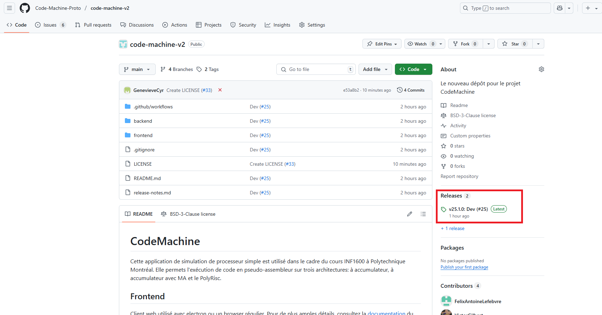
   </p>
<div style="page-break-after: always;"></div>
3. Choisir la bonne architecture (celle correspondant à votre ordinateur) et cliquer dessus pour la télécharger
   <p>
   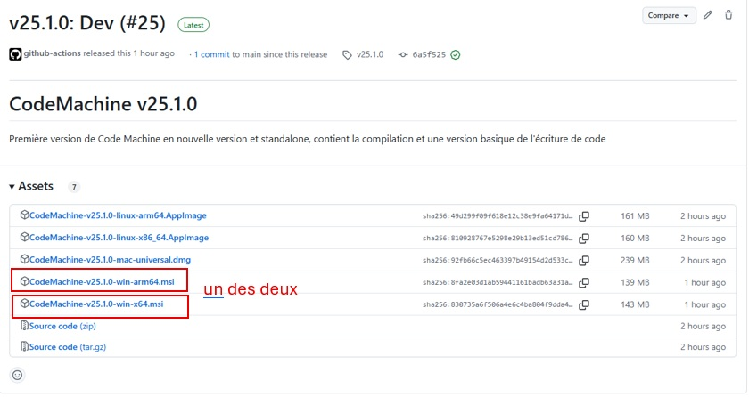
   </p>

4. Dans téléchargement, double-cliquer pour partir l’installation.
<br>

5. Cliquer sur Information complémentaires
   <p>
   
   </p>
<div style="page-break-after: always;"></div>
6. Choisir exécuter quand même
   <p>
   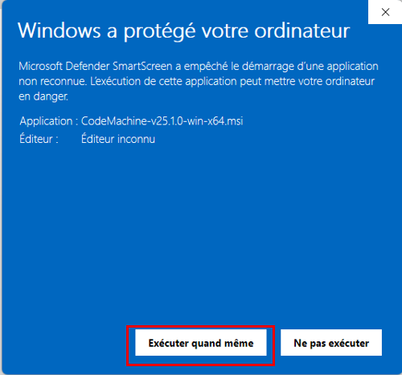
   </p>

7. Suivre les étapes d’installations
<div style="page-break-after: always;"></div>

8. Vous trouverez CodeMachine dans la barre de recherche
   <p>
   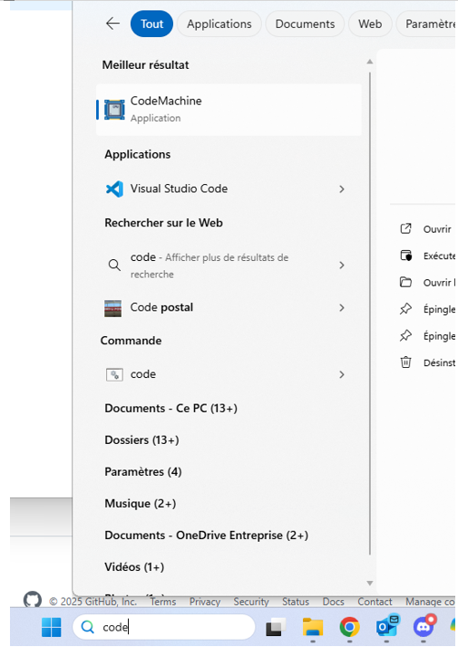
   </p>

<div style="page-break-after: always;"></div>

## Pour Linux

1. Aller sur GitHub : [Page GitHub de CodeMachine](https://github.com/Code-Machine-Proto/code-machine-v2)
<br>
2. Choisir le relâche la plus récente (cliquer dessus)
   <p>
   
   </p>

3. Choisir la bonne architecture (celle correspondant à votre ordinateur) et cliquer dessus pour la télécharger
   <p>
   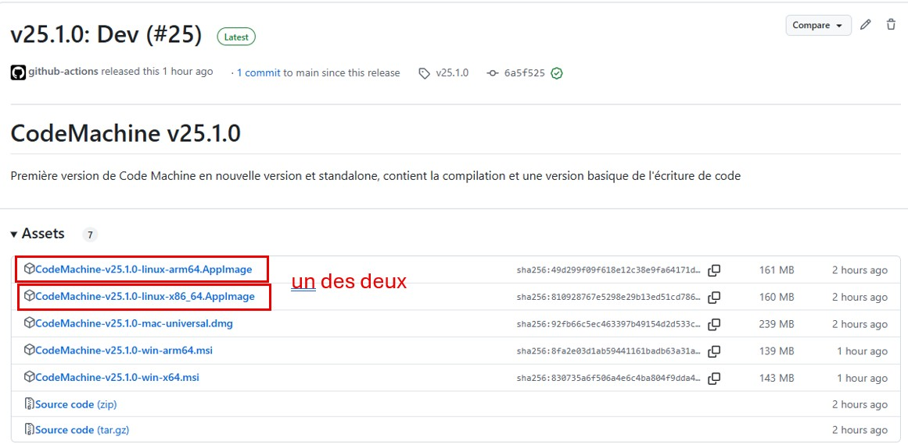
   </p>

4. Dans téléchargement, double-cliquer pour partir l’installation.
<br>

5. Ensuite, vous avez deux options, soit aller dans téléchargement et s’assurer que le fichier est exécutable, puis **double-cliquer pour partir CodeMachine (aucune installation requise)**.  
   <p>
   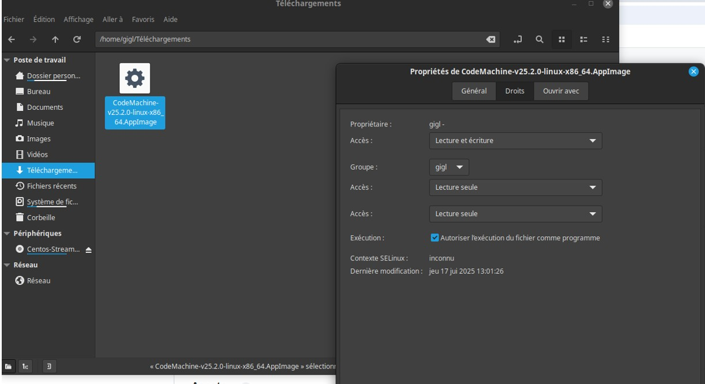
   </p>
Sinon, vous pouvez aller **par le CLI**, changer les permissions et partir l’outils comme suit :
   <p>
   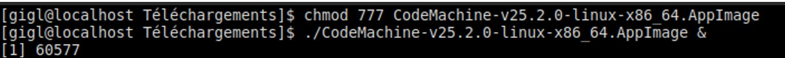
   </p>

*Notez que vous pouvez déplacer le .AppImage à l’endroit que vous préférez pour faciliter son accès.  Cependant, vous devrez, dans tous les cas, permettre son exécution en changeant ses permissions.*


<br>

>**ATTENTION : Sur Windows, dans certains installations, il faut parfois partir CodeMachine en mode administrateur pour qu'il compile correctement**

Si vous avez l'erreur suivante au moment de la compilation : 
<p>
   
</p>
Il faut repartir CodeMachine en tant qu'administrateur en utilisant le bouton contextuelle de la souris.
<p>
   
</p>


<div style="page-break-after: always;"></div>

## Pour MAC

### Méthode 1: Installation simplifiée (recommandée)

1. Aller sur GitHub : [Page GitHub de CodeMachine](https://github.com/Code-Machine-Proto/code-machine-v2)

2. Choisir le relâche la plus récente (cliquer dessus)
   <p>
   
   </p>

3. Choisir l'installeur pour Mac (le même pour toutes les architectures)
   <p>
   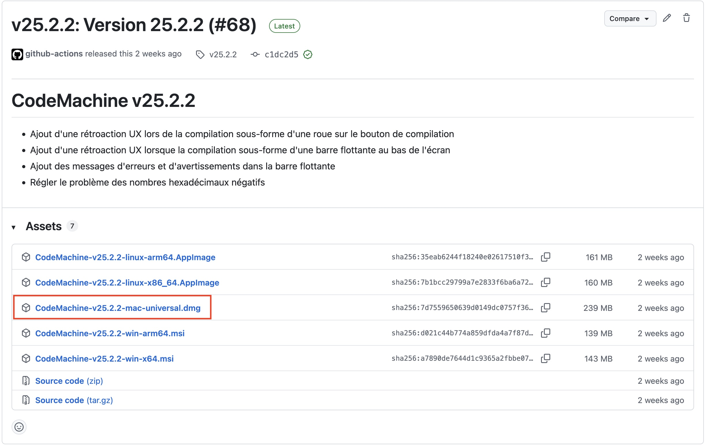
   </p>

4. Dans téléchargement, double-cliquer pour partir l'installation et compléter une installation selon le format dmg

5. **Première ouverture de CodeMachine:**
   - Double-cliquer sur l'application CodeMachine
   - macOS affichera un message indiquant que l'app ne peut pas être ouverte (app non signée)
   - Cliquer sur **OK**

6. **Autoriser l'ouverture dans les Préférences Système:**
   - Ouvrir **Préférences Système** (ou **Réglages Système** sur macOS Ventura+)
   - Aller dans **Sécurité et confidentialité** (ou **Confidentialité et sécurité**)
   - Dans l'onglet **Général**, vous verrez un message concernant CodeMachine
   - Cliquer sur le bouton **Ouvrir quand même**
   - Confirmer en cliquant **Ouvrir** dans la fenêtre de confirmation

7. L'application CodeMachine devrait maintenant se lancer normalement

<div style="page-break-after: always;"></div>

### Méthode 2: Installation via Terminal (méthode alternative)

1. Aller sur GitHub : [Page GitHub de CodeMachine](https://github.com/Code-Machine-Proto/code-machine-v2)

2. Choisir le relâche la plus récente (cliquer dessus)
   <p>
   
   </p>

3. Choisir l'installeur pour Mac (le même pour toutes les architectures)
   <p>
   
   </p>

4. Dans téléchargement, double-cliquer pour partir l'installation et compléter une installation selon le format dmg

5. Enlever les drapeaux de quarantaine mis par Apple
   <p>
   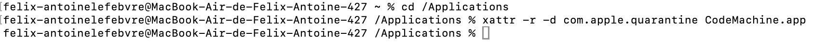
   </p>

6. Trouver l'application dans le Finder et afficher le contenu du paquet
   <p>
   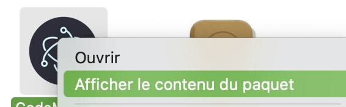
   </p>

7. Naviguer Contents > MacOS
   <p>
   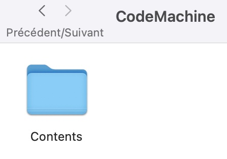
   </p>
   ---
   <p>
   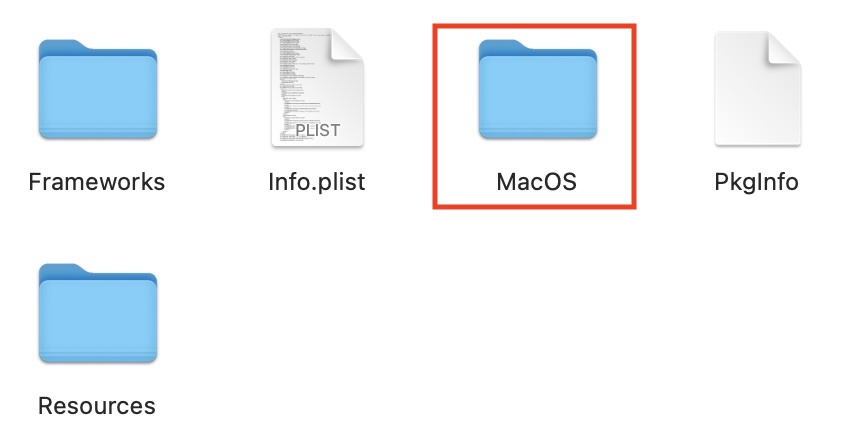
   </p>

8. Double-cliquer sur l'exécutable nommé CodeMachine pour le partir en mode administrateur, créer un alias pour mettre sur votre bureau est fortement recommandé
   <p>
   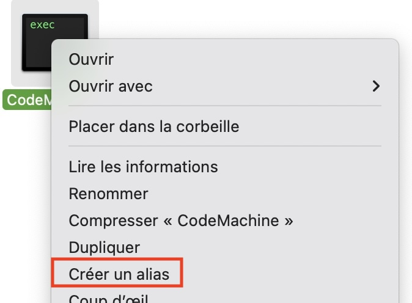
   </p>


<div style="page-break-after: always;"></div>

# Guide d’utilisation de CodeMachine

## Utilisation de l’interface graphique

### Version

Vous pourrez toujours savoir quelle version vous utilisez en regardant la version à cause de « Code Machine ».  Normalement, l’outils fonctionnel devrait avoir une version supérieure ou égale à 25.2.2.  Cependant, vous devriez toujours prendre la dernière version sur GitHub et vous pouvez voir les commentaires des modifications faites sur les versions directement dans Git.

### Architectures

Trois architectures sont disponibles dans CodeMachine : Accumulateur, Accumulateur-MA et PolyRisc.  Vous pouvez choisir l’architecture en cliquant sur le gros bouton.
   <p>
   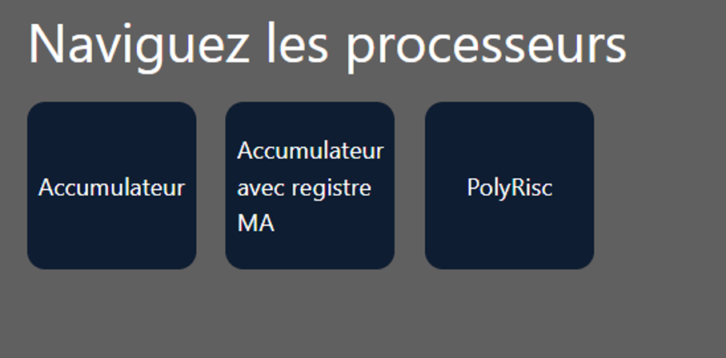
   </p>

### Raccourcis

- Pour faire un “Zoom In” : ctrl + (souvent  ctrl-shift=)
- Pour faire un “Zoom out” : ctrl –
- Vous pouvez être en mode « plein écran » ou non à votre choix.
- Lorsque vous écrivez le code, vous pouvez utiliser « ctrl-Z » et « ctrl-y » pour annuler ou répéter une frappe.
- Pour revenir au menu principal (donc quitter une architecture pour aller dans un autre), appuyer sur la flèche blanche ou directement sur Code Machine.
   <p>
   
   </p>

<div style="page-break-after: always;"></div>

### Compilation

- Le dernier code entré dans chaque architecture devrait être mémorisé quand vous quittez l’architecture.  Cependant, dès que vous quitté une architecture, en retournant dans n’importe quelle architecture, il faut recompiler.  Pour savoir si le code est compilé, regardé le / en haut.
   <p>
   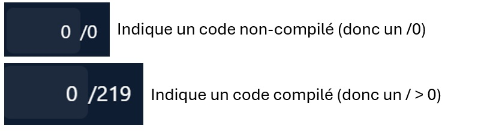
   </p>

- Durant la compilation, le bouton « Compiler » aura un indicateur de chargement et le bouton sera inaccessible. Le temps de compilation pour les architectures « Accumulateur » sont relativement rapide.  Pour le « PolyRisc », c’est plus long (cela peut prendre au-delà d’une minute pour plusieurs cycles)

### Affichage du nombre de cycles

>**ATTENTION : CodeMachine est limité à 1024 cycles au total.  Tout code qui donnera plus de 1024 cycles, seulement les 1024 premiers cycles seront exécutés.**

- Les cycles sont comptés à partir de 0, donc le nombre total de cycle (/nb) sera toujours égale au nombre de cycle -1.  Pour toutes les architecture, chaque instruction prend 3 cycles (incluant l’instruction « nop ».

- Pour naviguer dans le code vous avez plusieurs options.

    1. Utiliser le « play » (triangle bleu simple) et le code sera exécuté automatiquement, étapes par étapes.

    2. Utiliser les boutons « next step » ou « prévious step » (triangle bleu avec barre verticale), pour exécuter le code une étape à la fois.

    3. Utiliser les boutons « goto end » ou « goto start » (double triangle bleu), pour aller directement à a fin ou au début du code.

    4. Décider exactement à quel cycle aller en entrant le nombre de cycle à la place du chiffre qui apparaît avant le « / »
   <p>
   
   </p>

- Lorsque vous utiliser le mode « régulier », une étape correspond à un cycle.  Donc chaque instruction passera par les étapes : « fetch », « decode », « execute » (3 cycles).
   <p>
   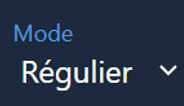
   </p>

- Lorsque vous utiliser le mode « exécution », chaque étape correspond à une instruction.  Ainsi, chaque étape passera d’une cycle « execute » d’une instruction à l’autre (par bon de 3 cycles).
   <p>
   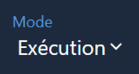
   </p>

- Le cycle auquel vous êtes rendu est toujours affiché dans le nombre avant le « / ». Attention de penser additionner un à ce nombre pour savoir exactement à quel cycle vous êtes rendus (puisque les cycles sont comptés à partir de 0).  Vous pouvez aussi, en tout temps, voir à quel stade d’exécution de l’instruction vous êtes dans le petit rectangle blanc : « fetch », « decode », « execute ».
   <p>
   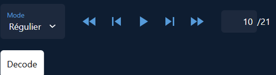
   </p>


### Surbrillance du code et erreur de syntaxes

- Normalement, les instructions sont en *rouge*, les « déclarations » d’étiquettes en *mauve* et les registres en *orange* et les valeurs ou « utilisation » d’étiquettes sont en *blanc* dans votre code.
   <p>
   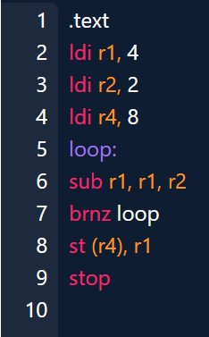
   </p>

- Les erreurs de syntaxes devraient être soulignées en *rouge* et les "warnings" en *jaune* et tant que vous avez des soulignements rouges dans le code, vous ne pourrez pas accéder au bouton « Compiler » qui sera *rouge*.  Normalement, lorsque vous avez des soulignées dans le code, une fenêtre devrait apparaître et vous indique le type d'erreur précédé du numéro de la ligne qui contient une erreur.  
   >**ATTENTION : Lorsqu'il y a une erreur dans une ligne de code, il se pourrait que la surbrillance des erreurs des lignes suivantes ne soient pas exactes.  Il est très important de régler les premières erreurs dans le code pour pouvoir continuer la correction des lignes suivantes**
- Si vous compiler et qu’une erreur se produit (qui n’a pas été détecter par le « parser »), un message vous l’indiquera, mais vous devrez trouver sans aide le problème de votre côté.  
   >**Ne vous gênez pas pour ouvrir des "issues" sur GitHub si ce genre de situation se produise pour qu'on puisse améliorer l'outils.**

- Les règles d’écriture du code sont données dans la section « Grammaire du code ».

- Si votre code est trop long pour s’afficher au complet à l’écran, vous devez utiliser la roulette de la souris pour faire défiler le code.  Il n’y a pas de barre de défilement.
- Vous pouvez voir l'instruction en cours d'excecution par sa surbrillance.

### Organisation mémoire

- **Les numéros de ligne** dans votre code assembleur **ne correspondent PAS** aux adresses mémoires réelles

- **Les directives** (`.text`, `.data`) ne sont **pas écrites en mémoire** - elles indiquent seulement au compilateur comment organiser les sections

- **Ordre en mémoire:**
  1. Section `.text` (programme) → placée en premier en mémoire
  2. Section `.data` (données) → placée après le code
  
- **Les étiquettes** (comme `loop:`) ne sont **pas écrites en mémoire** - elles sont remplacées par l'adresse de l'instruction suivante lors de l'assemblage

**Exemple:**
```
.text              # Cette directive n'occupe pas de mémoire
ld n               # Occupe de la mémoire (adresse 0)
loop:              # Remplacée par l'adresse réelle (adresse 1)
sub one            # Occupe de la mémoire (adresse 1)
brnz loop          # Occupe de la mémoire (adresse 2), "loop" → adresse 1
st n               # Occupe de la mémoire (adresse 3)
stop               # Occupe de la mémoire (adresse 4)

.data              # Cette directive n'occupe pas de mémoire
n: 5               # Occupe de la mémoire (adresse 5)
one: 1             # Occupe de la mémoire (adresse 6)
```

**Dans cet exemple:**
- Les instructions (`.text`) occupent les adresses 0 à 4
- Les données (`.data`) occupent les adresses 5 et 6
- L'étiquette `loop:` est remplacée par l'adresse 1
- Les directives `.text` et `.data` n'occupent aucun espace mémoire

### Mode d’affichage graphique

- Chaque architecture à 2 modes d’affichage graphique : mode « visuel » et mode « programmeur ». Contrôlable avec le bouton suivant : 
   <p>
   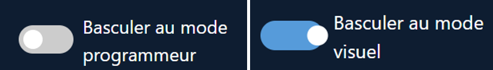
   </p>

- En mode « visuel », vous verrez le circuit matériel avec les différents blocs et les signaux qui sont actifs au cycle en cours seront en rouge.
   <p>
   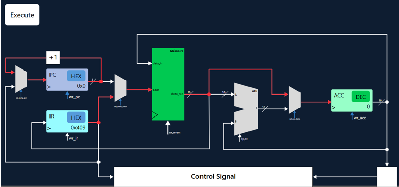
   </p>


- En mode « programmeur », vous verrez le contenu des registres, sans voir le circuit :
   <p>
   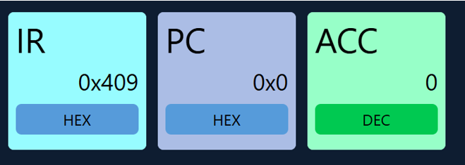
   </p>

<div style="page-break-after: always;"></div>

## Affichage de la mémoire

- Il est possible d’afficher ou masquer le contenu de la mémoire principale avec le bouton :
   <p>
   
   </p>

   Ce bouton est disponible en mode « visuel » ou en mode « programmeur » mais l’espace occupé par chaque partie sera adapté à l’espace d’écran disponible.  À vous de trouver ce qui vous convient le mieux.

- Le contenu de la mémoire ne s’affichera que lorsqu’un programme est compilé. 

- Pour les deux premières architectures, il n’y a qu’une mémoire qui contient les données et les instructions.
   <p>
   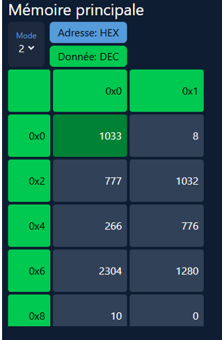
   </p>

- Il est possible de choisir si les adresses et les données sont en décimales ou en hexadécimales avec les deux boutons dans le haut de la mémoire.

- Vous pouvez aussi choisir le « mode » d’affichage (1, 2 ou 4) qui vous mettra 1, 2 ou 4 adresses par ligne (selon votre préférence).

- Vous remarquerez qu’il y a des adresses pour chaque ligne et chaque colonne.  En fait l’adresse mémoire d’une valeur (exemple : 776) correspond à la somme de l’adresse de la ligne et de la colonne (exemple : 0x4+0x1 = 0x5 pour la donnée 776).  Attention, dans CodeMachine les données sont TOUJOURS de 16 bits (2 octets) et ne sont pas accessibles par octet.  Chaque adresse mémoire pointe sur une case mémoire d’une grandeur de 16 bits.  Ce sont ces cases que vous voyez dans chaque rectangle.

- Pour se promener dans la mémoire et faire défiler les adresses, il n’y a pas de barre de défilement, vous devez utiliser la roulette de la souris pour faire défiler la mémoire.

- Pour le Polyrisc, l’affichage de la mémoire principale de données fonctionne de la même manière que les deux autres architectures.  Cependant, le Polyrisc a aussi une « mémoire » de registres à usage général ainsi qu’une mémoire programme.  Ces deux mémoires supplémentaires ne sont accessibles qu’en mode « programmeur » à l’aide de deux cases à cocher selon ce que vous voulez voir.
   <p>
   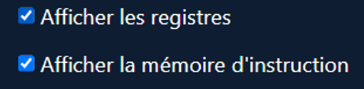
   </p>

- Le fonctionnement de l’affichage des 2 autres mémoires est exactement le même que pour la mémoire principale.  Cependant, notez que la largeur des données de la mémoire d’instruction du Polyrisc est de 28 bits et non de 16 bits comme toutes les autres mémoires.

- Vous pouvez donc, en more « programmeur » voir le contenu des 3 mémoires comme suit :
   <p>
   
   </p>

<div style="page-break-after: always;"></div>

## Grammaire du code

- Le code devra toujours suivre les règles suivantes :

- La directive « .data » est facultative et une directive « .data » vide est acceptée.

- Les étiquettes (« label ») doivent être constituées de seulement des lettres minuscules, des lettres majuscules, des chiffres et des tirets du bas(_) (attention, les étiquettes sont sensibles à la case)

- Les instructions doivent être en minuscules seulement (tout est sensible à la case)

- La déclaration des étiquettes doit toujours mettre le « : » sans espace entre l’étiquette et le « : » (Ex : loop: et non loop : )

- Les nombres entrés dans le code, comme valeur, doivent toujours êtres des nombres entiers (négatif ou non)

- Chaque instruction doit être séparée par un « new line » (retour de charriot)

- A part pour la déclaration d’étiquettes, il n’y a aucune dépendance aux espaces

- Les lignes vides à la fin du code ne sont pas problématiques.

- Les commentaires peuvent utiliser le « # »  ou les  « // » et ce n’importe où dans la ligne (sans code ou après le code)

<div style="page-break-after: always;"></div>

## Comment entrer des « issues » sur CodeMachine.

Si vous avez des problèmes avec CodeMachine, vous pouvez les souligner aux développeurs.  Cela se fera directement sur GitHub.

1. Vous devez d’abord aller dans « Issues » :
   <p>
   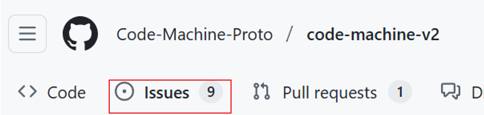
   </p>

2. Regarder si votre problème n’a pas été déjà entrée en lisant les « open » issues
   <p>
   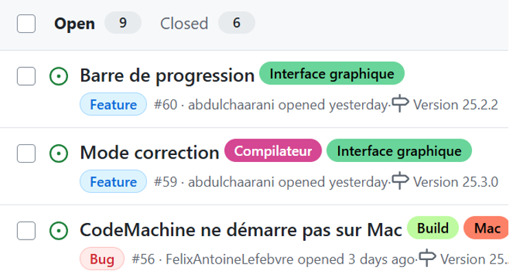
   </p>

3. Aller dans « New Issue »
   <p>
   
   </p>

4. Choisir « bug » si c’est un problème avec ce qui est déjà implanté ou « nouvelle fonctionnalité » si vous avez une demande de modifications de CodeMachine (dans sa fonctionnalité).
   <p>
   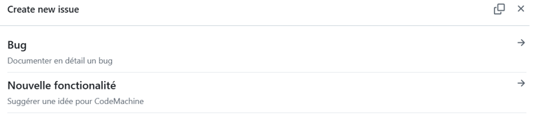
   </p>

5. Dans chacun des cas, il y a un « template » de base qui vous guide dans l’information à entrer dans votre « issue » pour faciliter la compréhension du développeur.  SVP, suivez ces instructions pour faciliter leur travail.

Notez que vous avez accès au code (c’est « open source »), alors vous pouvez faire un clone et jouer dans le code à votre aise si vous le désirer.  Vous avez aussi une manière de déployez votre version automatiquement (pour vous-même), mais nous ne supporterons pas le code, juste l’interface.  De plus, les accès en écriture sont proscrits, seulement les développeurs pourront changer le code en cours.

<div style="page-break-after: always;"></div>

# Architecture Processeur-accumulateur

## Circuit logique

### CodeMachine
   <p>
   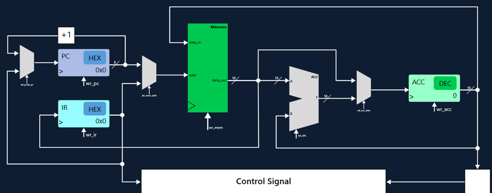
   </p>

### Détaillé
   <p>
   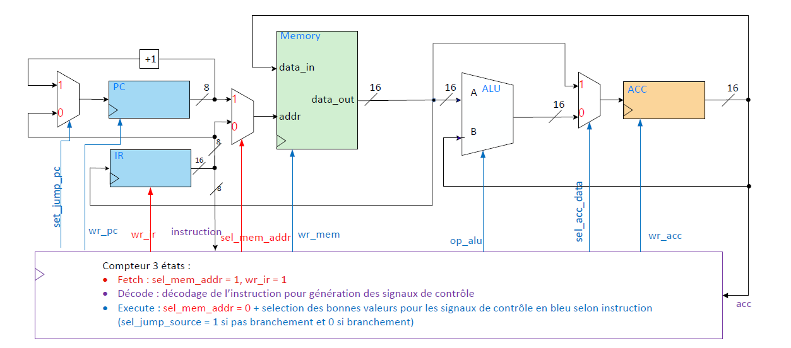
   </p>

<div style="page-break-after: always;"></div>

## Instructions
| Instruction | Encodage | Description |
| --- | --- | --- |
| add ADR | 0x00XX | ACC <-  ACC + Mémoire[ADR] |
| sub ADR | 0x01XX | ACC <-  ACC - Mémoire[ADR] |
| mul ADR | 0x02XX | ACC <-  ACC × Mémoire[ADR] |
| st ADR | 0x03XX | Mémoire[ADR] <-  ACC |
| ld ADR | 0x04XX | ACC <-  Mémoire[ADR] |
| stop | 0x05XX | Arrêt du programme |
| br ADR | 0x07XX | PC <-  ADR |
| brz ADR | 0x08XX | ACC = 0 ? PC <- ADR : PC <-  PC + 1 |
| brnz ADR | 0x09XX | ACC != 0 ? PC <-  ADR : PC <-  PC + 1 |

### Opérations ALU
| op_alu | opération |
| --- | --- |
| 0 | B + A |
| 1 | B – A |
| 2 | B x A |


<div style="page-break-after: always;"></div>

# Architecture Processeur-accumulateur-MA

## Circuit logique

### CodeMachine
   <p>
   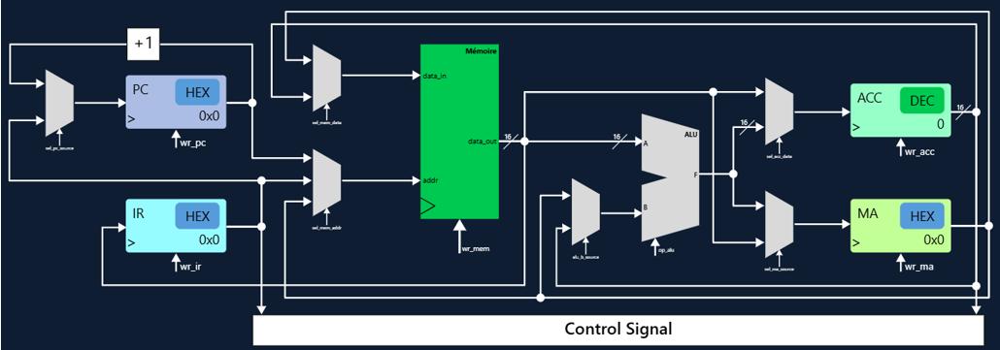
   </p>
   
**Attention:** Une nouvelle instruction (lea) a été ajoutée dans le jeu d'instructions et n'est pas encore représentée dans le schéme de CodeMachine.  Voici ce qu'il manque et sera ajouté éventuellement dans l'interface graphique.
   <p>
   
   </p>

Pour plus de détails, consultez [l'issue #123](https://github.com/Code-Machine-Proto/code-machine-v2/issues/123) sur GitHub.


<div style="page-break-after: always;"></div>

### Détaillé
   <p>
   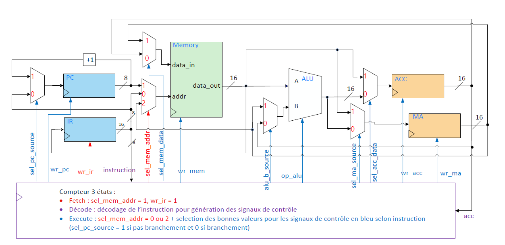
   </p>

<div style="page-break-after: always;"></div>

## Instructions
| Instruction | Encodage | Description |
| --- | --- | --- |
| add ADR | 0x00XX | ACC <-  ACC + Mémoire[ADR] |
| sub ADR | 0x01XX | ACC <-  ACC - Mémoire[ADR] |
| mul ADR | 0x02XX | ACC <-  ACC × Mémoire[ADR] |
| adda ADR | 0x03XX | MA  <-  MA  + Mémoire[ADR] |
| suba ADR | 0x04XX | MA  <-  MA  - Mémoire[ADR] |
| addx | 0x05XX | ACC <-  ACC + Mémoire[MA] |
| subx | 0x06XX | ACC <-  ACC - Mémoire[MA] |
| ld ADR | 0x07XX | ACC <-  Mémoire[ADR] |
| st ADR | 0x08XX | Mémoire[ADR] <-  ACC |
| lda ADR | 0x09XX | MA  <-  Mémoire[ADR] |
| sta ADR | 0x0AXX | Mémoire[ADR] <-  MA |
| ldi | 0x0BXX | ACC <-  Mémoire[MA] |
| sti | 0x0CXX | Mémoire[MA] <-  ACC |
| br ADR | 0x0DXX | PC <-  ADR |
| brz ADR | 0x0EXX | ACC = 0 ? PC <-  ADR : PC <-  PC + 1 |
| brnz ADR | 0x0FXX | ACC != 0 ? PC <-  ADR : PC <-  PC + 1 |
| shl | 0x10XX | ACC <-  ACC << 1 |
| shr | 0x11XX | ACC <-  ACC >> 1 |
| lea ADR | 0x12XX | MA <- ADR |
| stop | 0x13XX | Arrêt du programme |

### Opérations ALU
| op_alu | opération |
| --- | --- |
| 0 | B + A |
| 1 | B – A |
| 2 | B x A |
| 3 | B << 1 |
| 4 | B >> 1 |

<div style="page-break-after: always;"></div>

# PolyRisc

## Circuit logique

### CodeMachine
   <p>
   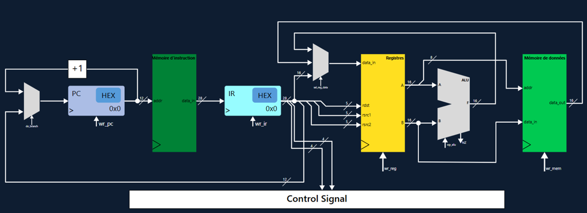
   </p>

### Détaillé
   <p>
   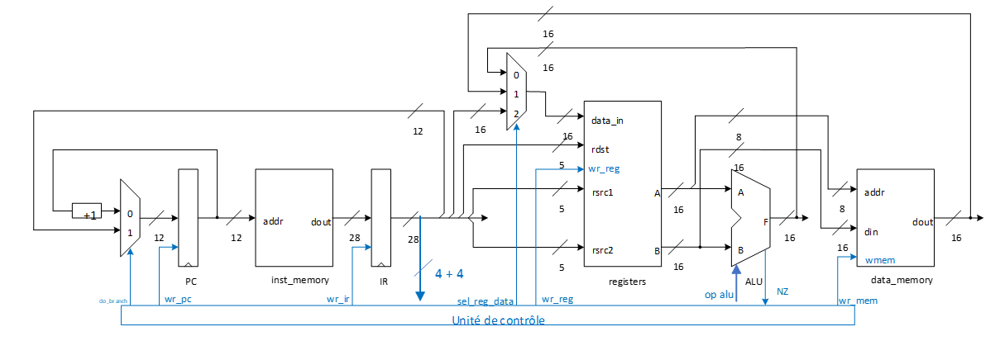
   </p>

<div style="page-break-after: always;"></div>

## Instructions
   <p>
   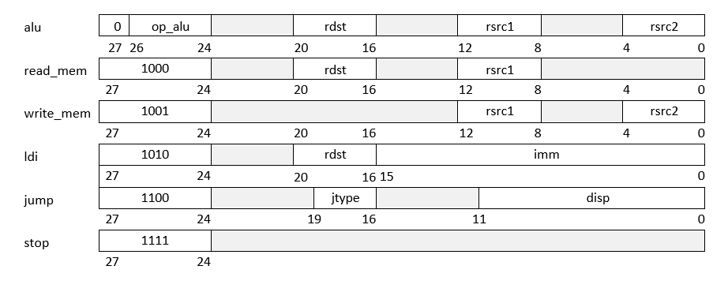
   </p>

### Format des types d'instruction

### Types et syntaxe des instructions de l’UAL et de branchements
| Champ | Valeur | Type d’opération | Syntaxe assembleur |
| --- | --- | --- | --- |
| op | 0 | Addition arithmétique | add	rdst, rsrc1, rsrc2 |
| op | 1 | Soustraction arithmétique | sub	rdst, rsrc1, rsrc2 |
| op | 2 | Décalage binaire à droite | shr	rdst, rsrc1 |
| op | 3 | Décalage binaire à gauche | shl	rdst, rsrc1 |
| op | 4 | NON logique | not	rdst, rsrc1 |
| op | 5 | ET logique | and	rdst, rsrc1, rsrc2 |
| op | 6 | OU logique | or	rdst, rsrc1, rsrc2 |
| op | 7 | Affectation | mv	rdst, rsrc1 |
| jtype | 0 | Jump non conditionnel | br	label |
| jtype | 1 | Jump si nul (Z=1) | brz	label |
| jtype | 2 | Jump si non nul (Z=0) | brnz label |
| jtype | 3 | Jump si négatif (N=1) | brlz label |
| jtype | 4 | Jump si non négatif (N=0) | brgez label |

<div style="page-break-after: always;"></div>

### Types et syntaxe des instructions de lecture, écriture, chargement et d'arrêt
| Type d’opération | Syntaxe assembleur |
| --- | --- |
| Lecture de la mémoire | ld	rdst, (rsrc1) |
| Ecriture dans la mémoire | st	(rsrc1), rsrc2 |
| Chargement d’un immédiat | ldi	rdst, imm |
| Arrêter l’exécution | Stop |
